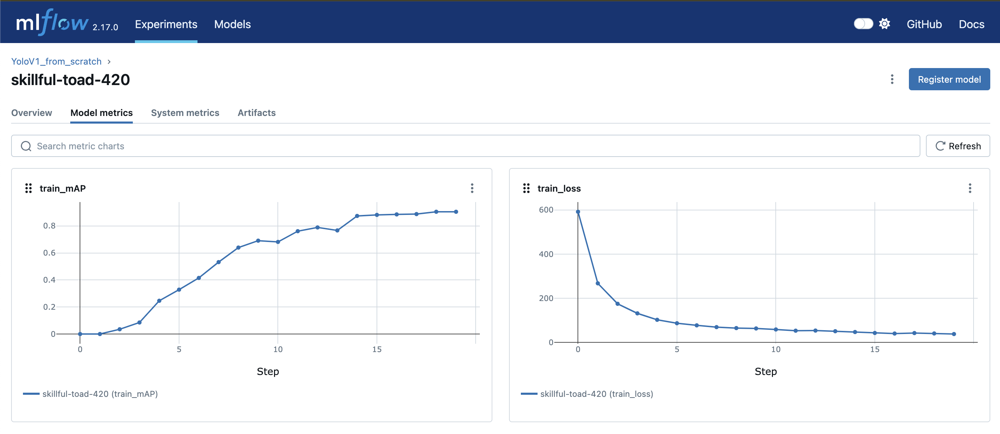

# YoloV1 Object Detection Implementation

This repository implements a YoloV1 model for object detection using PyTorch. The project utilizes custom utilities, datasets, and configurations for training, evaluation, and prediction.

## Directory Structure

```plaintext
datasets/                 # Directory containing the training and testing dataset
nets/                     # Contains the YoloV1 model and configuration files
  nets_config.py           # Configuration for the YoloV1 network
  nets.py                  # YoloV1 model architecture
resources/                # Resources for model training and evaluation
  mlflow_output.png        # Output image of MLflow tracking
  banana.jpg               # Sample image for testing
utils/                    # Utility functions for dataset loading, loss computation, etc.
  dataset.py               # Custom dataset class for loading fruit images
  utils.py                 # Helper functions for loss and evaluation
  mlflow_config.py         # MLflow configuration file
dockerfile                # Dockerfile for containerizing the project
.dockerignore             # File to ignore unnecessary files in Docker builds
notebook.ipynb            # Jupyter notebook for running and visualizing the model
requirements.txt          # Python dependencies for the project
``` 

## Requirements

To run this project, you'll need the following dependencies. Install them using `pip`:

```bash
pip install -r requirements.txt
```

### Key Dependencies  
- `torch` - PyTorch for building and training the model.  
- `torchvision` - For image transformations and pre-trained models.  
- `mlflow` - For tracking experiments and logging model metrics.  
- `pandas` - For handling datasets in DataFrame format.  
- `tqdm` - For progress bars during training.

## How to Run

### Step 1: Set Up Dataset

Place your training and testing dataset in the `datasets` folder:  
- Training images and annotations should be in `datasets/train_zip/train/`.  
- Testing images and annotations should be in `datasets/test_zip/test/`.

### Step 2: Modify Configurations

If needed, modify the following configurations:  
- `LEARNING_RATE` in `notebook.ipynb` for setting the learning rate for the Adam optimizer.  
- `BATCH_SIZE`, `EPOCHS`, and other parameters to suit your environment and dataset.

### Step 3: Train the Model

Run the following command to start training the YoloV1 model:

```bash
jupyter notebook notebook.ipynb
```

This will train the YoloV1 model for object detection on the fruit dataset. During training, the following logs will be saved:  
- Training loss for each epoch.  
- Mean Average Precision (mAP) for evaluating model performance.  
- Model checkpoints will be saved to `model.pth`.  
- MLflow logs, including parameters and metrics, will be stored for experiment tracking.

The training progress is displayed using an interactive progress bar powered by `tqdm`.

### Step 4: Evaluate the Model

After training, the model can be evaluated on the test set using the `predict_model` function. It calculates the mAP for the test set and prints the results.

### Step 5: MLflow Experiment Tracking

MLflow is used for experiment tracking. Training parameters, metrics (like loss and mAP), and model checkpoints are logged automatically during training.

To view the training metrics and model results, open the MLflow dashboard:

```bash
mlflow ui
```

Visit `http://localhost:5000` to view the experiment results.

## Code Explanation

- **Model Architecture**: The YoloV1 model is defined in `nets/nets.py` using PyTorch. It processes input images and predicts bounding boxes and class probabilities.  
- **Dataset Handling**: Custom dataset handling is implemented in `utils/dataset.py` to load images and their corresponding annotations.  
- **Loss Function**: A custom loss function for YoloV1, defined in `utils/utils.py`, is used to compute the prediction error based on bounding box and classification accuracy.  
- **Training Loop**: The training loop is implemented in `notebook.ipynb`, where we define the optimizer, loss function, and evaluation metrics. The training loss and mAP are logged using MLflow.  
- **Prediction**: After training, the model is used to make predictions on the test data, with results printed to the console.

## Results

The training results, including loss and mAP, can be visualized in the MLflow UI. The model's performance on the test set is logged as the final mAP score.

### Mlflow Output  


## Acknowledgments

- The original implementation of YoloV1 is based on the [YoloV1 paper](https://arxiv.org/abs/1506.02640).  
- The dataset used in this project is based on a collection of fruit images for object detection [dataset](https://www.kaggle.com/datasets/mbkinaci/fruit-images-for-object-detection).

